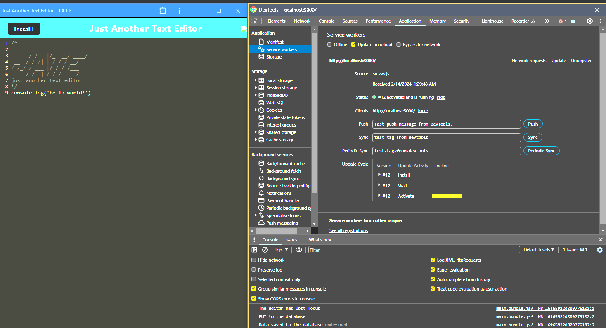

  # Just another text editor

   ## Table-of-Contents

  * [Description](#description)
  * [Installation](#installation)
  * [Usage](#usage)
  * [License](#license)
  * [Contributing](#contributing)
  * [Tests](#tests)
  * [Questions](#questions)
 

  ## Description
My journey to create this PWA Text Editor project was fueled by a simple yet ambitious desire: to bring to life a text editor that feels right at home in your web browser, but with a twist—it works perfectly even when you're offline. Imagine having a reliable buddy that keeps your notes safe, no matter where you are or whether you've got Wi-Fi. I was captivated by the idea of using the latest web tricks to make sure everything you type stays put, giving you that smooth, hassle-free experience we've all come to love in our favorite apps. This project was my playground for blending the technical magic of Progressive Web Applications (PWAs) with the practical needs we face every day, turning a complex concept into something straightforward and genuinely useful for everyone.  

The seed for this project was planted by my fascination with the untapped potential of Progressive Web Applications (PWAs)—those nifty web creatures that promise to keep you going even when the internet decides to take a break. I wanted to dive headfirst into the world of offline functionality and data that sticks around, courtesy of some behind-the-scenes heroes called IndexedDB and service workers. My goal? To whip up a text editor that lives in your browser but doesn't blink at the thought of going offline. It's designed with developers and writers in mind, offering a cozy corner for their thoughts and code snippets, accessible anytime, anywhere. This adventure was about bridging two worlds: the convenience of online tools and the independence of offline access, ensuring a smooth ride without any hiccups, connectivity be damned.  

This project is my answer to a nagging question: How can we keep our digital musings safe from the abyss of internet unpredictability? With the PWA Text Editor, I aimed to tackle the all-too-familiar fear of losing our precious notes and code snippets to the void of connectivity issues. By bringing together IndexedDB for sturdy, on-the-spot storage, and service workers to keep the show running offline, I envisioned a sanctuary where your work is not just saved but cherished and ready for you whenever you need it. This approach lifts the weight of "what ifs" off your shoulders, empowering you with the freedom to work uninterrupted, no matter the whims of your internet connection. It's about transforming a complex technical solution into a reliable friend that ensures your creative flow is never broken.  



[Click Here to Demo the Live Application!](https://just-another-text-editor-fl0x.onrender.com/)

  ## Installation
  To install the PWA Text Editor project, follow these steps:

1. Clone the Repository:

   Obtain the repository URL and use Git to clone it to your local machine with the command:  
   ```git clone git@github.com:EricRisher/just-another-text-editor.git```
   
2. Navigate to the Project Directory:

   Change into the project directory using:  
   ```cd main```
   
3. Install Dependencies:

   Install the required npm packages specified in the package.json file by running:  
   ```npm install```
   
4. Start the Application:

   Run the application locally by executing:  
   ```npm run start```  
   This command starts both the backend and serves the client, bundling the JavaScript files using webpack.  

5. Access the Application:

   Open your web browser and go to http://localhost:3000 to use the text editor.  
     

6. Install the PWA (Optional):
   
   If supported by your browser, you should see an "Install" icon in the address bar to download and install the web application on your desktop for offline use.

  ## Usage
  To illustrate the usage of the PWA Text Editor after installation, let's walk through a typical user scenario:

Starting the Application  

- After completing the installation steps, you launch the application by navigating to http://localhost:3000 in your web browser. The text editor interface loads, presenting a clean, minimalistic design ready for text input.  

Creating Notes or Code Snippets  

- Input: You start typing your notes or code snippets directly into the text area provided. The interface is intuitive, allowing for straightforward text entry without any distractions.

- Persistence: As you type, the application automatically saves your entries to IndexedDB. If you click off the text editor window (e.g., switch tabs or applications), the content remains saved.

Retrieving Data
- Upon Return: When you reopen the text editor after closing it or even after losing your internet connection, you find that all your previously entered content is intact and displayed exactly as you left it, thanks to the data being retrieved from IndexedDB.  

Offline Functionality
- Working Offline: You test the application's offline capabilities by disabling your internet connection and continuing to use the text editor. The application functions seamlessly, proving its reliability without an active internet connection.  

Installing the Application
- Installation Prompt: At some point, you notice an "Install" button or prompt in the browser. Clicking on it installs the application on your desktop, creating an icon for easy access.

- Launching as a Desktop App: You launch the installed PWA from your desktop, enjoying a standalone experience that feels similar to using a native application, with all the functionalities available offline.

Utilizing Advanced Features  

- Service Worker: The service worker pre-caches your static assets, ensuring that the application loads quickly and reliably each time you open it, enhancing the overall user experience.

  ## Questions
  If you have any questions, please contact me at 
  rishereric13@gmail.com
  or visit my GitHub page at
  [GitHub](https://github.com/ericrisher)

